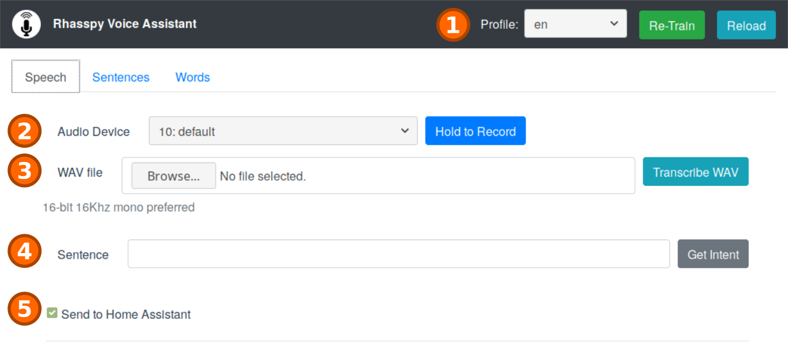
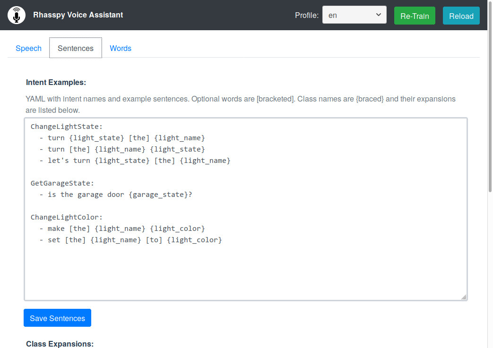
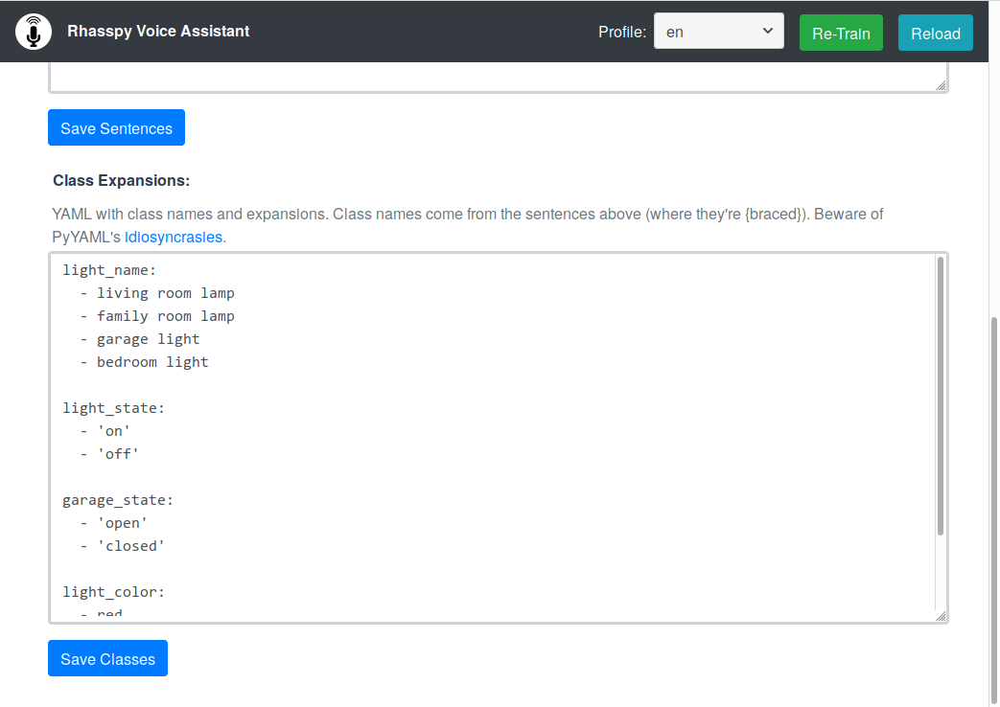

Tutorial
==========

1. Download the latest release of the [Rhasspy Hass.io add-on](https://github.com/synesthesiam/rhasspy-hassio/releases)
2. Extract/copy the files into a `rhasspy` directory in your Hass.io `/addons` directory (see [this tutorial](https://developers.home-assistant.io/docs/en/hassio_addon_tutorial.html) for details on installing local add-ons)
3. Refresh your add-ons in the `Add-On Store` tab and click on  "Rhasspy Assistant" under "Local add-ons"
4. Click `INSTALL` and watch the system log (under the Hass.io `System` tab) to see when it's finished (it may take 30 minutes or more on a Raspberry Pi)
5. Click `Start` and wait until
6. Click `Open Web UI` to open the web interface. If you get a connection error, Rhasspy may still be starting up. Wait a minute and refresh.

Rhasspy Web Interface
--------------------------

Rhasspy's web-based user interface lets you manage custom words and commands as
well as test Rhasspy using your microphone or by uploading a WAV file.

### Speech

The default tab in Rhasspy is `Speech`, which lets you tests various aspects of
Rhasspy's speech/intent recognition:

The image above shows important parts of the web interface:

1. The currently selected *profile*
  * `Re-Train` - trains the speech/intent recognizer with your custom sentences/words
  * `Reload` - clears cached speech/intent objects from memory
2. The microphone that will be used to record
  * `Hold to Record` - start recording from microphone when pressed, stop recording when released
3. Upload a pre-recorded WAV for to run through the speech recognizer
  * Preferred format is 16-bit 16Khz mono
4. Type a sentence to test intent recognizer
  * Holds transcription from speech recognizer when record/upload functionality is used
5. Send any recognized intents directly to Home Assistant

### Sentences

This tab contains the custom commands for Rhasspy to recognize. These are split into two parts. First, there are *intents* - the kinds of things you want Rhasspy to do, such as turn on/off lights or tell you what the state of a given sensor is. Each intent contains one or more *sentence templates* - these generate all the possible ways you can express an intent.

Expansions for templated class names in example sentences:

