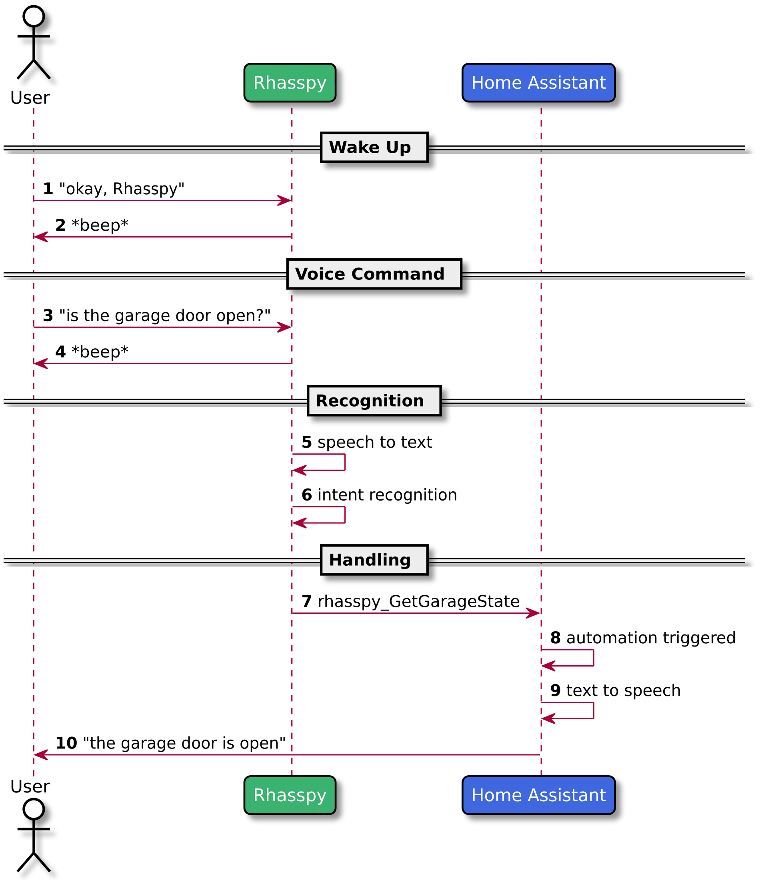

Rhasspy (pronounced RAH-SPEE) is an offline, [multilingual](#supported-languages) voice assistant toolkit inspired by [Jasper](https://jasperproject.github.io/) that works well with [Home Assistant](https://www.home-assistant.io/), [Hass.io](https://www.home-assistant.io/hassio/), and [Node-RED](https://nodered.org).

Rhasspy transforms voice commands into [JSON](https://json.org) events that can trigger actions in home automation software, like [Home Assistant automations](https://www.home-assistant.io/docs/automation/trigger/#event-trigger) or [Node-RED flows](usage.md#node-red). You define custom voice commands in a [profile](profiles.md) using a [specialized template syntax](training.md), and Rhasspy takes care of the rest.

## Motivation

A typical voice assistant (Alexa, Google Home, etc.) solves a number of important problems:

1. Deciding when to record audio ([wake word](wake-word.md))
2. Listening for voice commands ([command listener](command-listener.md))
3. Transcribing command/question ([speech to text](speech-to-text.md))
4. Interpreting the speaker's **intent** from the text ([intent recognition](intent-recognition.md))
5. Fulfilling the speaker's intent ([intent handling](intent-handling.md))

Rhasspy provides **offline, private solutions** to problems 1-4 using off-the-shelf tools. These tools are:

* **Wake word**
    * [Pocketsphinx keyphrase](https://cmusphinx.github.io/wiki/tutoriallm/#using-keyword-lists-with-pocketsphinx)
    * [Mycroft Precise](https://github.com/MycroftAI/mycroft-precise)
    * [snowboy](https://snowboy.kitt.ai)
    * [porcupine](https://github.com/Picovoice/Porcupine)
* **Command listener**
    * [webrtcvad](https://github.com/wiseman/py-webrtcvad)
* **Speech to text**
    * [Pocketsphinx](https://github.com/cmusphinx/pocketsphinx)
    * [Kaldi](https://kaldi-asr.org)
* **Intent recognition**
    * [OpenFST](https://www.openfst.org)
    * [fuzzywuzzy](https://github.com/seatgeek/fuzzywuzzy)
    * [Mycroft Adapt](https://github.com/MycroftAI/adapt)
    * [flair](http://github.com/zalandoresearch/flair)
    * [Rasa NLU](https://rasa.com/)

For problem 5 (fulfilling the speaker's intent), Rhasspy works with external home automation software, such as Home Assistant's built-in [automation capability](https://www.home-assistant.io/docs/automation/) or a [Node-RED flow](https://nodered.org). For each intent you define, Rhasspy emits a JSON event that can, for example, be used to do anything Home Assistant can do (toggle switches, call REST services, etc.). This means that Rhasspy will do very little out of the box compared to other voice assistants, but there are also be *no limits* to what can be done.

## Supported Languages

Rhasspy currently supports the following languages:

* English (`en`)
* German (`de`)
* Spanish (`es`)
* French (`fr`)
* Italian (`it`)
* Dutch (`nl`)
* Russian (`ru`)
* Greek (`el`)
* Hindi (`hi`)
* Mandarin (`zh`)
* Vietnamese (`vi`)
* Portuguese (`pt`)
* Swedish (`sv`)
* Catalan (`ca`)

Support for these languages comes directly from existing [CMU Sphinx](https://sourceforge.net/projects/cmusphinx/files/Acoustic%20and%20Language%20Models/) and [Kaldi](https://montreal-forced-aligner.readthedocs.io/en/latest/pretrained_models.html) acoustic models.

It is possible to extend Rhasspy to new languages with only:

* A [phonetic dictionary](https://cmusphinx.github.io/wiki/tutorialdict/#using-g2p-seq2seq-to-extend-the-dictionary)
* A trained [acoustic model](https://cmusphinx.github.io/wiki/tutorialam/)
* A [grapheme to phoneme model](https://github.com/AdolfVonKleist/Phonetisaurus)

The table below summarizes language support across the various supporting technologies that Rhasspy uses:

| Category               | Name                                           | Offline?               | en       | de       | es       | fr       | it       | nl       | ru       | el       | hi       | zh       | vi       | pt       | sv       | ca       |
| --------               | ------                                         | --------               | -------  | -------  | -------  | -------  | -------  | -------  | -------  | -------  | -------  | -------  | -------  | -------  | -------  | -------  |
| **Wake Word**          | [pocketsphinx](wake-word.md#pocketsphinx)      | &#x2713;               | &#x2713; | &#x2713; | &#x2713; | &#x2713; | &#x2713; | &#x2713; | &#x2713; | &#x2713; | &#x2713; | &#x2713; |          |          |          |          |
|                        | [porcupine](wake-word.md#porcupine)            | &#x2713;               | &#x2713; |          |          |          |          |          |          |          |          |          |          |          |          |          |
|                        | [snowboy](wake-word.md#snowboy)                | *requires account*     | &#x2713; | &bull;   | &bull;   | &bull;   | &bull;   | &bull;   | &bull;   | &bull;   | &bull;   | &bull;   | &bull;   | &bull;   | &bull;   | &bull;   |
|                        | [precise](wake-word.md#mycroft-precise)        | &#x2713;               | &#x2713; | &bull;   | &bull;   | &bull;   | &bull;   | &bull;   | &bull;   | &bull;   | &bull;   | &bull;   | &bull;   | &bull;   | &bull;   | &bull;   |
| **Speech to Text**     | [pocketsphinx](speech-to-text.md#pocketsphinx) | &#x2713;               | &#x2713; | &#x2713; | &#x2713; | &#x2713; | &#x2713; | &#x2713; | &#x2713; | &#x2713; | &#x2713; | &#x2713; |          | &#x2713; |          | &#x2713; |
|                        | [kaldi](speech-to-text.md#kaldi)               | &#x2713;               |          |          |          |          |          |          |          |          |          |          | &#x2713; |          | &#x2713; |          |
| **Intent Recognition** | [fsticuffs](intent-recognition.md#fsticuffs)   | &#x2713;               | &#x2713; | &#x2713; | &#x2713; | &#x2713; | &#x2713; | &#x2713; | &#x2713; | &#x2713; | &#x2713; | &#x2713; | &#x2713; | &#x2713; | &#x2713; | &#x2713; |
|                        | [fuzzywuzzy](intent-recognition.md#fuzzywuzzy) | &#x2713;               | &#x2713; | &#x2713; | &#x2713; | &#x2713; | &#x2713; | &#x2713; | &#x2713; | &#x2713; | &#x2713; | &#x2713; | &#x2713; | &#x2713; | &#x2713; | &#x2713; |
|                        | [adapt](intent-recognition.md#mycroft-adapt)   | &#x2713;               | &#x2713; | &#x2713; | &#x2713; | &#x2713; | &#x2713; | &#x2713; | &#x2713; | &#x2713; | &#x2713; | &#x2713; | &#x2713; | &#x2713; | &#x2713; | &#x2713; |
|                        | [flair](intent-recognition.md#flair)           | &#x2713;               | &#x2713; | &#x2713; | &#x2713; | &#x2713; |          | &#x2713; |          |          |          |          |          | &#x2713; |          | &#x2713; |
|                        | [rasaNLU](intent-recognition.md#rasanlu)       | *needs extra software* | &#x2713; | &#x2713; | &#x2713; | &#x2713; | &#x2713; | &#x2713; | &#x2713; | &#x2713; | &#x2713; | &#x2713; | &#x2713; | &#x2713; | &#x2713; | &#x2713; |
| **Text to Speech**     | [espeak](text-to-speech.md#espeak)             | &#x2713;               | &#x2713; | &#x2713; | &#x2713; | &#x2713; | &#x2713; | &#x2713; | &#x2713; | &#x2713; | &#x2713; | &#x2713; | &#x2713; | &#x2713; | &#x2713; | &#x2713; |
|                        | [flite](text-to-speech.md#flite)               | &#x2713;               | &#x2713; |          |          |          |          |          |          |          | &#x2713; |          |          |          |          |          |
|                        | [picotts](text-to-speech.md#picotts)           | &#x2713;               | &#x2713; |          |          |          |          |          |          |          |          |          |          |          |          |          |
|                        | [marytts](text-to-speech.md#marytts)           | &#x2713;               | &#x2713; | &#x2713; |          | &#x2713; | &#x2713; |          | &#x2713; |          |          |          |          |          |          |          |
|                        | [wavenet](text-to-speech.md#google-wavenet)    |                        | &#x2713; | &#x2713; | &#x2713; | &#x2713; | &#x2713; | &#x2713; | &#x2713; |          | &#x2713; | &#x2713; |          | &#x2713; | &#x2713; |          |

&bull; - yes, but requires training/customization

## How It Works

Rhasspy starts off asleep, listening for a [wake word](wake-word.md). Once awoken, it listens for a [voice command](command-listener.md). After recording the command, its transcribed with the [speech to text](speech-to-text.md) system into text, which is then run through an [intent recognizer](intent-recognition.md). Finally, the recognized intent is used to generate an event that can be [handled by Home Assistant or Node-RED](intent-handling.md). 

## Customization

Every step of Rhasspy's processing pipeline can be customized, including using a remote Rhasspy server via its [HTTP API](usage.md#http-api) for [speech to text](speech-to-text.md#remote-http-server) and [intent recognition](intent-recognition.md#remote-http-server). Some useful Rhasspy API endpoints are:

* `/api/listen-for-command`
    * POST to wake Rhasspy up and start listening for a voice command
* `/api/train`
    * POST to re-train your profile
* `/api/speech-to-intent`
    * POST a WAV file and have Rhasspy process it as a voice command
* `/api/text-to-intent`
    * POST text and have Rhasspy process it as command
* `/api/text-to-speech`
    * POST text and have Rhasspy speak it

Additionally, you can call out to a custom external program for [wake word detection](wake-word.md#command), [voice command listening](command-listener.md#command), [speech recognition](speech-to-text.md#command), [intent recognition](intent-recognition.md#command), and event [intent handling](intent-handling.md#command)! This means that you can use Rhasspy as a general voice command toolkit, with or without Home Assistant.

## RGB Light Example

Let's say you have an RGB light of some kind in your bedroom that's [hooked up already to Home Assistant](https://www.home-assistant.io/components/light.mqtt). You'd like to be able to say things like "*set the bedroom light to red*" to change its color. To start, let's write a [Home Assistant automation](https://www.home-assistant.io/docs/automation/action/) to help you out:

    automation:
      # Change the light in the bedroom to red.
      trigger:
        ...
      action:
        service: light.turn_on
        data:
          rgb_color: [255, 0, 0]
          entity_id: light.bedroom
          
Now you just need the trigger! Rhasspy will send events that can be caught with the [event trigger platform](https://www.home-assistant.io/docs/automation/trigger/#event-trigger). A different event will be sent for each *intent* that you define, with slot values corresponding to important parts of the command (like light name and color). Let's start by defining an intent in Rhasspy called `ChangeLightColor` that can be said a few different ways:

    [ChangeLightColor]
    colors = (red | green | blue) {color}
    set [the] (bedroom){name} [to] <colors>
    
This is a [simplified JSGF grammar](doc/sentences/md) that will generate the following sentences:

* set the bedroom to red
* set the bedroom to green
* set the bedroom to blue
* set the bedroom red
* set the bedroom green
* set the bedroom blue
* set bedroom to red
* set bedroom to green
* set bedroom to blue
* set bedroom red
* set bedroom green
* set bedroom blue

Rhasspy uses these sentences to create an [ARPA language model](https://cmusphinx.github.io/wiki/arpaformat/) for speech recognition, and also train an intent recognizer that can extract relevant parts of the command. The `{color}` tag in the `colors` rule will make Rhasspy put a `color` property in each event with the name of the recognized color (red, green, or blue). Likewise, the `{name}` tag on `bedroom` will add a `name` property to the event.

If trained on these sentences, Rhasspy will now recognize commands like "*set the bedroom light to red*" and send a `rhasspy_ChangeLightState` to Home Assistant with the following data:

    {
      "name": "bedroom",
      "color": "red"
    }
    
You can now fill in the rest of the Home Assistant automation:
    
    automation:
      # Change the light in the bedroom to red.
      trigger:
        platform: event
        event_type: rhasspy_ChangeLightState
        event_data:
          name: bedroom
          color: red
      action:
        service: light.turn_on
        data:
          rgb_color: [255, 0, 0]
          entity_id: light.bedroom
          
This will handle the specific case of setting the bedroom light to red, but not any other color. You can either add additional automations to handle these, or make use of [automation templating](https://www.home-assistant.io/docs/automation/templating/) to do it all at once.
 
Intended Audience
---------------------

Rhasspy is intended for advanced users that want to have a voice interface to Home Assistant, but value **privacy** and **freedom** above all else. There are many other voice assistants, but none (to my knowledge) that:

1. Can function **completely disconnected from the Internet**
2. Are entirely free/open source
3. Work well with Home Assistant, Hass.io, and Node-RED

If you feel comfortable sending your voice commands through the Internet for someone else to process, or are not comfortable with rolling your own Home Assistant automations to handle intents, I recommend taking a look at [Mycroft](https://mycroft.ai).
